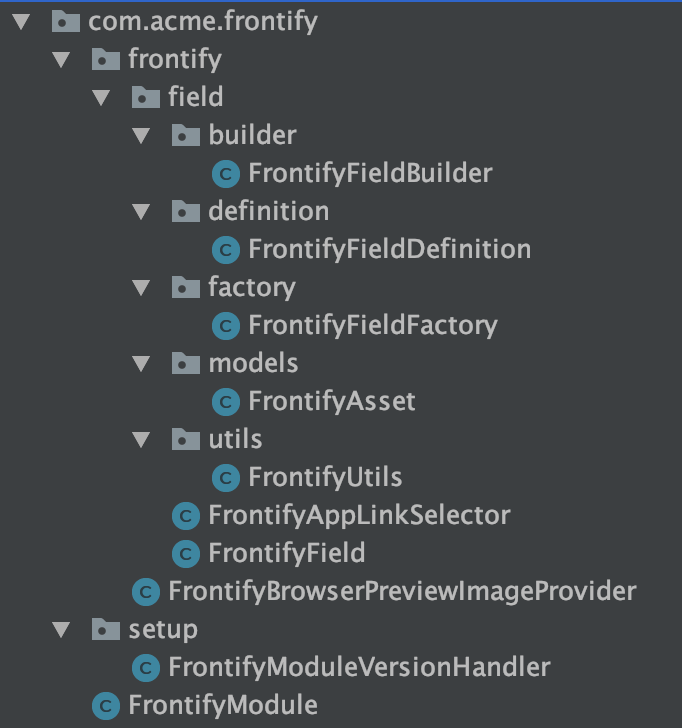
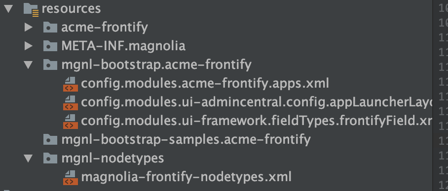
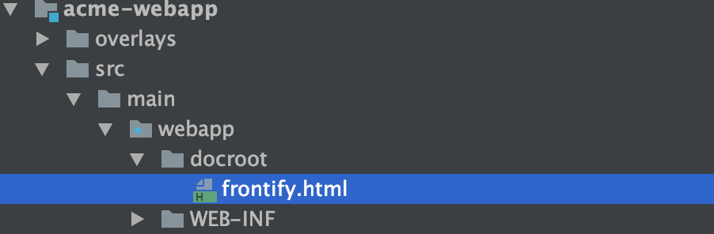
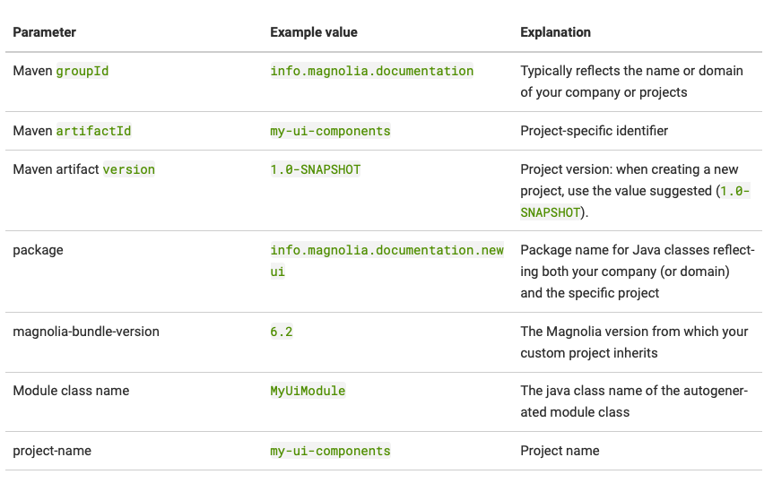

# Frontify-Library - Magnolia 5

## Creating the project
On your local file system, create a new directory for the project, change into the directory and execute the following Maven command:
```
mvn archetype:generate -DarchetypeGroupId=info.magnolia.maven.archetypes -DarchetypeArtifactId=magnolia-project-archetype -DarchetypeVersion=RELEASE
```

Maven prompts you to specify values for several parameters. **Use values that fit your requirements.**

:information_source: Take a note of the value you enter for the magnolia-bundle-version property. You will need it later on to create your own module.
```
Define value for property 'groupId': com.acme.webapps
Define value for property 'artifactId': acme
Define value for property 'version' 1.0-SNAPSHOT: :
Define value for property 'package' com.acme.webapps: :
Define value for property 'magnolia-bundle-version': 5.7
Define value for property 'project-name' acme: : acme-project
Confirm properties configuration:
groupId: com.acme.webapps
artifactId: acme
version: 1.0-SNAPSHOT
package: com.acme.webapps
magnolia-bundle-version: 5.7
project-name: acme-project
 Y: :
```

The project is a Maven multi-module setup, with a webapp building into a WAR file.

You can open the project in your IDE. The directory structure created looks like this:
```
acme
├── acme-webapp
│   ├── pom.xml
│   └── src
│       └── main
│           └── webapp
│               ├── WEB-INF
│               │   ├── bootstrap
│               │   │   ├── author
│               │   │   ├── common
│               │   │   └── public
│               │   └── config
│               │       └── default
│               └── docroot
└── pom.xml
```

## Creating your own module
In this step, you create a Magnolia module to be used to develop your website. The archetypes can help you do most of the work.
In the project directory, issue the following command:
```
mvn archetype:generate -DarchetypeGroupId=info.magnolia.maven.archetypes -DarchetypeArtifactId=magnolia-module-archetype -DarchetypeVersion=RELEASE
```

Maven asks you again to supply some property values. 

For the magnolia-bundle-version, enter the value you have used above when creating the project.
```
Define value for property 'groupId': com.acme.frontify
Define value for property 'artifactId': acme-frontify-module
Define value for property 'version' 1.0-SNAPSHOT: :
Define value for property 'package' com.acme.frontify: :
Define value for property 'magnolia-bundle-version': 5.7
Define value for property 'module-class-name': FrontifyModule
Define value for property 'module-name' acme-frontify-module: : acme-frontify
Confirm properties configuration:
groupId: com.acme.frontify
artifactId: acme-frontify-module
version: 1.0-SNAPSHOT
package: com.acme.frontify
magnolia-bundle-version: 5.7
module-class-name: FrontifyModule
module-name: acme-frontify
 Y: :
```

For every additional module added to the project you will find an entry in the parent pom.
```
<modules>
    <module>acme-webapp</module>
    <module>acme-frontify</module>
</modules>
```

## Integrate Frontify Library
Add frontify files in *acme/acme-frontify/src/main/java/com/acme/frontify/frontify*




Add also the resources files in the coresponding folder



## Add files for bootstrapping in *FrontifyModuleVersionHandler*
```
package com.acme.frontify.setup;

import info.magnolia.module.DefaultModuleVersionHandler;
import info.magnolia.module.InstallContext;
import info.magnolia.module.delta.BootstrapSingleModuleResource;
import info.magnolia.module.delta.Task;

import java.util.ArrayList;
import java.util.List;

/**
 * This class is optional and lets you manage the versions of your module,
 * by registering "deltas" to maintain the module's configuration, or other type of content.
 * If you don't need this, simply remove the reference to this class in the module descriptor xml.
 *
 * @see info.magnolia.module.DefaultModuleVersionHandler
 * @see info.magnolia.module.ModuleVersionHandler
 * @see info.magnolia.module.delta.Task
 */
public class FrontifyModuleVersionHandler extends DefaultModuleVersionHandler {
    @Override
    protected List<Task> getExtraInstallTasks(InstallContext installContext) {

        final List<Task> tasks = new ArrayList<>();


        tasks.add(new BootstrapSingleModuleResource("config.modules.ui-admincentral.config.appLauncherLayout.groups.edit.apps.xml"));
        tasks.add(new BootstrapSingleModuleResource("config.modules.acme-frontify.apps.xml"));
        tasks.add(new BootstrapSingleModuleResource("config.modules.ui-framework.fieldTypes.frontifyField.xml"));
        
        return tasks;
    }

    @Override
    protected List<Task> getStartupTasks(InstallContext installContext) {

        final List<Task> tasks = new ArrayList<>();

        tasks.addAll(getExtraInstallTasks(installContext));

        return tasks;
    }
}
```
## In your acme/acme-frontify/src/main/resources/META-INF/magnolia/acme-frontify.xml add the nodetype file and register your workspace
```
  <repositories>
    <repository>
      <name>magnolia</name>
      <workspaces>
        <workspace>frontify-app</workspace>
      </workspaces>
      <nodeTypeFile>/mgnl-nodetypes/magnolia-frontify-nodetypes.xml</nodeTypeFile>
    </repository>
  </repositories>
```
## In your webapp docroot folder add the frontify.html file(*acme/acme-webapp/src/main/webapp/docroot*)


## How to use frontify asset in the templates
In your dialog use this snippet:
```
form:
  tabs:
    - name: tabMain
      fields:
        - name: assetFrontify
          i18n: true
          class: info.magnolia.ui.form.field.definition.LinkFieldDefinition
          label: Frontify Asset
          targetWorkspace: frontify-app
          appName: frontify-app
          identifierToPathConverter:
            class: info.magnolia.ui.form.field.converter.BaseIdentifierToPathConverter
          contentPreviewDefinition:
            contentPreviewClass: com.acme.frontify.frontify.field.FrontifyAppLinkSelector
        - name: newFrontify
          class: com.acme.frontify.frontify.field.definition.FrontifyFieldDefinition
          label: "New Frontify Field"
          targetWorkspace: frontify-app
          appName: frontify-app
          identifierToPathConverter:
            class: info.magnolia.ui.form.field.converter.BaseIdentifierToPathConverter
          contentPreviewDefinition:
            contentPreviewClass: com.acme.frontify.frontify.field.FrontifyAppLinkSelector
actions:
  commit:
    class: info.magnolia.ui.admincentral.dialog.action.SaveDialogActionDefinition
  cancel:
    class: info.magnolia.ui.admincentral.dialog.action.CancelDialogActionDefinition


```

Then in your freemarker template refer to your frontify asset like this:
```
<div>
    [#--check for db field--]
    [#if content.assetFrontify?has_content]
        [#assign assetFrontify = cmsfn.contentById(content.assetFrontify!, "frontify-app"!)!/]
        [#if assetFrontify?has_content && assetFrontify.genericUrl?has_content]
            
        [/#if]
    [/#if]

    [#--check for new frontify field--]
    [#if content.newFrontify?has_content]
        [#assign assetFrontify = cmsfn.contentById(content.newFrontify!, "frontify-app"!)!/]
        [#if assetFrontify?has_content && assetFrontify.genericUrl?has_content]
            
        [/#if]
    [/#if]
</div>
```
If you would like to use different property you just have to change it here:

*${assetFrontify.**genericUrl**!"default generic url"}*

*${assetFrontify.**title**!"default title"}*

*${assetFrontify.**width**!"default width"}*

*${assetFrontify.**height**!"default height"}*


# Frontify-Library - Magnolia 6

## Creating the project
On your local file system, create a new directory for the project, change into the directory and execute the following Maven command:
```
mvn archetype:generate -DarchetypeGroupId=info.magnolia.maven.archetypes -DarchetypeArtifactId=magnolia-project-archetype -DarchetypeVersion=RELEASE
```
When prompted to supply values for archetype parameters, enter the following **Use values that fit your requirements.**:
```
groupId: com.example
artifactId: custom-project-minimal
version: 1.0-SNAPSHOT
package: com.example
magnolia-bundle-version: 6.2
project-name: custom-project-minimal
```
Confirm the configuration by entering **Y**.

The Maven archetype script creates this webapp skeleton:
```
custom-project-minimal
├── custom-project-minimal-webapp
│ ├── pom.xml - The webapp POM
│ └── src
└── pom.xml - The parent POM
```
Editing the parent POM:
```
1. In the dependencyManagement section, remove the Option A.
2. Uncomment the Option B.
<!-- Option B -->
<!-- If you want to use the DX CORE. -->
```
Editing the webapp POM:
1. Remove the commented option ii and option iii. Keep the option i, which imports the empty webapp.

## Creating a custom Magnolia Maven module
In the project directory, issue the following command:
```
mvn archetype:generate -DarchetypeGroupId=info.magnolia.maven.archetypes -DarchetypeArtifactId=magnolia-module-archetype -DarchetypeVersion=RELEASE
```
Values:



Generated files and folders:
```
my-ui-components/
├── pom.xml
└── src
    ├── main
    │ ├── java
    │ └── resources
    └── test
        ├── java
        └── resources
```
Now add the dependency for the magnolia UI framework (core) module.

**my-ui-components/pom.xml (fragment)**
```
  <dependencies>
    <dependency>
      <groupId>info.magnolia</groupId>
      <artifactId>magnolia-core</artifactId>
    </dependency>
    <dependency>
      <groupId>info.magnolia.ui</groupId>
      <artifactId>magnolia-ui-framework</artifactId>
    </dependency>
  </dependencies>
```
Runtime dependencies in the module descriptor:
**src/main/resources/META-INF/magnolia/my-ui-components.xml**
```
<?xml version="1.0" encoding="UTF-8"?>
<!DOCTYPE module SYSTEM "module.dtd" >
<module>
  <name>my-ui-components</name>
  <displayName>${project.name}</displayName>
  <description>${project.description}</description>
  <class>info.magnolia.documentation.newui.MyUiModule</class>
  <versionHandler>info.magnolia.documentation.newui.setup.MyUiModuleVersionHandler</versionHandler>
  <version>${project.version}</version>
  <dependencies>
    <dependency>
      <name>core</name>
      <version>6.0/*</version>
    </dependency>
    <dependency>
      <name>ui-framework-core</name>
      <version>6.0/*</version>
    </dependency>
  </dependencies>
</module>
```
### Adding the custom module to a custom webapp via Maven
Parent POM (fragment):
```
  <dependencyManagement>
    <dependencies>
   <!-- you may have
           many more sections here -->
      <!-- new entry for the new module -->
      <dependency>
        <groupId>info.magnolia.documentation</groupId>
        <artifactId>my-ui-components</artifactId>
        <version>1.0-SNAPSHOT</version>
      </dependency>
    </dependencies>
  </dependencyManagement>
```
Webapp POM (fragment)
```
  <dependencies>
  <!-- you may have many more sections here -->

  <!-- new entry for the new module -->
    <dependency>
      <groupId>info.magnolia.documentation</groupId>
      <artifactId>my-ui-components</artifactId>
    </dependency>
  </dependencies>
```
### Install dependency
Installation
```
<dependency>
  <groupId>info.magnolia.ui</groupId>
  <artifactId>magnolia-ui-framework-javascript</artifactId>
  <version>${ui-framework-javascript.version}</version>
</dependency>
```
Versions: 
1.1.3 = Magnolia 6.2
```
<dependency>
  <groupId>info.magnolia.ui</groupId>
  <artifactId>magnolia-ui-framework-javascript</artifactId>
  <version>1.1.3</version>
</dependency>
```
Configuration
Add a JavaScript field in your dialog definition as follows:
```
label: Home Page
form:
  implementationClass: info.magnolia.ui.javascript.form.FormViewWithChangeListener
  properties:
    frontifyField:
      label: Frontify field
      $type: javascriptField
      fieldScript: /uimodule/webresources/frontify-lib/frontifyField.html
      styleName: popupStyleNameForFrontifyLibrary
      height: 340
      defaultValue: /.resources/my-ui-components/webresources/frontify-lib/img/placeholder.jpg

```
Don't forget to set the correct path for your custom module!

Properties:
```
 $type: Needs to be javascriptField
 fieldScript: Points to a valid HTML file located in any module (Maven & Light modules)
 height: The height of the field in the dialog
 defaultValue: The field default value
 parameters: Allows passing custom parameters to the Javascript field
```

### Don't forget to set your `defaultBaseUrl` in the `/server@defaultBaseUrl` configuration.

This is how you print your asset in your .ftl file:
```
<!DOCTYPE html>
<html>
  <head>
    [@cms.page /]
    <meta charset="utf-8" />
    <meta name="viewport" content="width=device-width, initial-scale=1, shrink-to-fit=no" />
  </head>
  <body>
    <h1>Frontify field example</h1>
    [#assign frontifyField = content.frontifyField!]
    <b>Frontify Field:</b> <br />
    
  </body>
</html>

```
### In your webresources folder add the library files:
```
curl -LJO https://github.com/Frontify/magnolia/tree/master/library/magnolia6/frontify-lib
```

In frontifyField.html change the variable with the name of your module
```
// CHANGE: Your Module Name
var MODULE_NAME = "uimodule";
```
